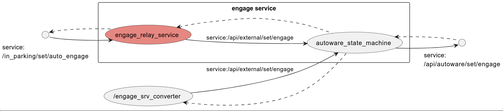

# engage_service

## Overview
It receives an engagement service, the engagement decides whether to enable or disable it based on its current state, and relays to the required service.

## Node Graph

## Launch arguments
none